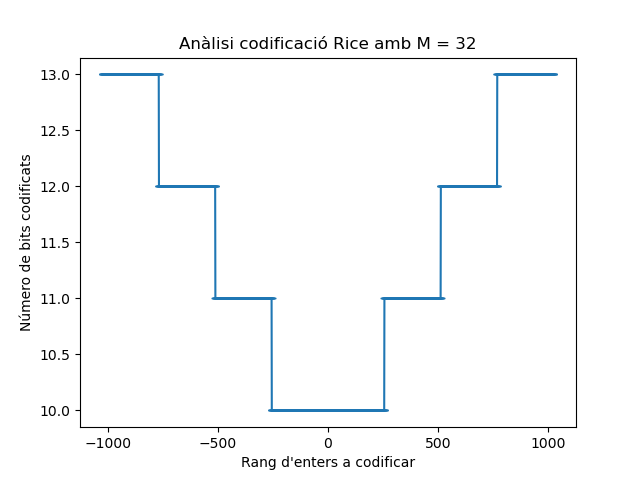

# Codificació Rice

## Preguntes
**1. Quants bits son necessaris per codificar tots els enters entre -1023 i +1023 (en codificació binaria natural amb bit de signe)?**<br>

Per representar 1023 números en format binaris necessitem 10 bits ja que $2^{10}= 1024$. Aleshores per representar el signe positiu o negatiu hem d'afegir un bit a l'esquerra de tot sent el bit més significatiu determinant si és positiu (1) o negatiu (0).<br><br>

**2. Calculeu el codi Rice de tots els enters N entre -1023 i +1023 amb M = 32.**<br>

El resultat sencer es podrà veure executant el codi que hi ha al fitxer [Main](https://github.com/jordiBujaldon/TM-Rice/blob/master/src/Main.java) del projecte. Un resum del resultat és el següent:
```
507 = 1 10 11111011 | total bits = 11
508 = 1 10 11111100 | total bits = 11
509 = 1 10 11111101 | total bits = 11
510 = 1 10 11111110 | total bits = 11
511 = 1 10 11111111 | total bits = 11
512 = 1 110 00000000 | total bits = 12
513 = 1 110 00000001 | total bits = 12
514 = 1 110 00000010 | total bits = 12
515 = 1 110 00000011 | total bits = 12
516 = 1 110 00000100 | total bits = 12
517 = 1 110 00000101 | total bits = 12
518 = 1 110 00000110 | total bits = 12
519 = 1 110 00000111 | total bits = 12
```
Els números 507-519 representen un petit rang dins del -1023 i +1023.<br><br>

**3. Per quins rangs de valors de N, el codi Rice necessita menys bits que la codificació binaria natural amb el bit de signe necessari per representar tot el rang entre -1023 i +1023? Si la majoria de dades a codificar pertanyen a aquest rang (rang d'entrada òptima), l'ús del codi Rice és recomenable (hi haurà estalvi de bits). Quin és el màxim estalvi de bits?**

El resultat segueix un mateix patró tant per positius com per negatius:<br><br>
<br><br>
Veiem que el rang de bits codificats segons els valors del rang van de 10 a 13 bits, seguint una simetria tant per positius com negatius. Per tant, els valors que necessita menys bits per a la codificació són els que van del rang -255 al +255. 

Si utilitzessim la codificació binaria normal, obtindriem un processament total de $2047 * 11 = 22.517$ bits. I si utilitzem la codificació Rice en aquest rang òptim, tenim un processament total de $2047 * 10 = 20.470$. Això significa que ens hauriem estalviat 2047 bits que vindria a ser un 10% menys respecte els bits inicials, i realment si que seria recomenable.
