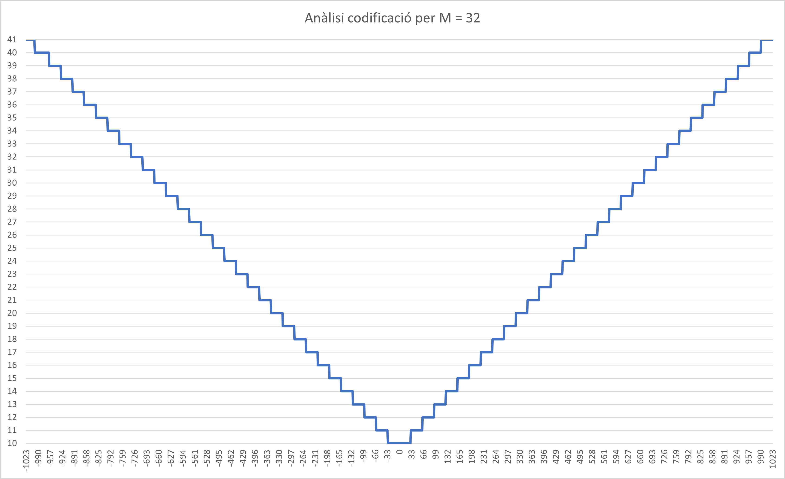

# Codificació Rice

## Preguntes
**1. Quants bits son necessaris per codificar tots els enters entre -1023 i +1023 (en codificació binaria natural amb bit de signe)?**<br>

Per representar 1023 números en format binaris necessitem 10 bits ja que $2^{10}= 1024$. Aleshores per representar el signe positiu o negatiu hem d'afegir un bit a l'esquerra de tot sent el bit més significatiu determinant si és positiu (1) o negatiu (0).<br><br>

**2. Calculeu el codi Rice de tots els enters N entre -1023 i +1023 amb M = 32.**<br>

El resultat sencer es podrà veure executant el codi que hi ha al fitxer [Main](https://github.com/jordiBujaldon/TM-Rice/blob/master/src/Main.java) del projecte. Un resum del resultat és el següent:
```
823 = 1 11111111111111111111111110 00010111 | total bits = 35
824 = 1 11111111111111111111111110 00011000 | total bits = 35
825 = 1 11111111111111111111111110 00011001 | total bits = 35
826 = 1 11111111111111111111111110 00011010 | total bits = 35
827 = 1 11111111111111111111111110 00011011 | total bits = 35
828 = 1 11111111111111111111111110 00011100 | total bits = 35
829 = 1 11111111111111111111111110 00011101 | total bits = 35
830 = 1 11111111111111111111111110 00011110 | total bits = 35
831 = 1 11111111111111111111111110 00011111 | total bits = 35
832 = 1 111111111111111111111111110 00000000 | total bits = 36
833 = 1 111111111111111111111111110 00000001 | total bits = 36
834 = 1 111111111111111111111111110 00000010 | total bits = 36
835 = 1 111111111111111111111111110 00000011 | total bits = 36
836 = 1 111111111111111111111111110 00000100 | total bits = 36
837 = 1 111111111111111111111111110 00000101 | total bits = 36
```
Els números 823-837 representen un petit rang dins del -1023 i +1023.<br><br>

**3. Per quins rangs de valors de N, el codi Rice necessita menys bits que la codificació binaria natural amb el bit de signe necessari per representar tot el rang entre -1023 i +1023? Si la majoria de dades a codificar pertanyen a aquest rang (rang d'entrada òptima), l'ús del codi Rice és recomenable (hi haurà estalvi de bits). Quin és el màxim estalvi de bits?**

El resultat segueix un mateix patró tant per positius com per negatius:<br><br>
<br><br>
Veiem que el rang de bits codificats segons els valors del rang van de 10 a 41 bits (eix vertical), seguint una simetria tant per positius com negatius. Per tant, els valors que necessita menys bits per a la codificació són els que van del rang -31 al +31, ja que son els que tenen un total de bits de 10. 

Si utilitzessim la codificació binaria normal, obtindriem un processament total de $2047 * 11 = 22.517$ bits. I si utilitzem la codificació Rice en aquest rang òptim, tenim un processament total de $2047 * 10 = 20.470$. Això significa que ens hauriem estalviat 2047 bits que vindria a ser un 10% menys respecte els bits inicials, i realment si que seria recomenable.<br><br>

**4. Analitzeu per quin valor de M el rang òptim d'entrada s'exten fins a -255 i +255. Quin és l'estalvi de bits en aquest cas?**<br>

Executant el fitxer [Main](https://github.com/jordiBujaldon/TM-Rice/blob/master/src/Main.java) anomenat anteriorment, en l'apartat `d` del missatge de sortida, es pot veure els resultats dels mínim bits codificats i el rang on es troben:
```
M: 2 = minim 10 bits, amb rang l'inici de rang negatiu -1
M: 4 = minim 10 bits, amb rang l'inici de rang negatiu -3
M: 8 = minim 10 bits, amb rang l'inici de rang negatiu -7
M: 16 = minim 10 bits, amb rang l'inici de rang negatiu -15
M: 32 = minim 10 bits, amb rang l'inici de rang negatiu -31
M: 64 = minim 10 bits, amb rang l'inici de rang negatiu -63
M: 128 = minim 10 bits, amb rang l'inici de rang negatiu -127
M: 256 = minim 10 bits, amb rang l'inici de rang negatiu -255
M: 512 = minim 10 bits, amb rang l'inici de rang negatiu -255
M: 1024 = minim 10 bits, amb rang l'inici de rang negatiu -255
M: 2048 = minim 10 bits, amb rang l'inici de rang negatiu -255
M: 4096 = minim 10 bits, amb rang l'inici de rang negatiu -255
M: 8192 = minim 10 bits, amb rang l'inici de rang negatiu -255
M: 16384 = minim 10 bits, amb rang l'inici de rang negatiu -255
M: 32768 = minim 10 bits, amb rang l'inici de rang negatiu -255
M: 65536 = minim 10 bits, amb rang l'inici de rang negatiu -255
M: 131072 = minim 10 bits, amb rang l'inici de rang negatiu -255
M: 262144 = minim 10 bits, amb rang l'inici de rang negatiu -255
M: 524288 = minim 10 bits, amb rang l'inici de rang negatiu -255
M: 1048576 = minim 10 bits, amb rang l'inici de rang negatiu -255
M: 2097152 = minim 10 bits, amb rang l'inici de rang negatiu -255
M: 4194304 = minim 10 bits, amb rang l'inici de rang negatiu -255
M: 8388608 = minim 10 bits, amb rang l'inici de rang negatiu -255
```
Veiem que a partir del valor M de 256, els rangs més òptims es mantenen en -255 i +255. Això vol dir que la tendencia d'aquests valors és la següent:
